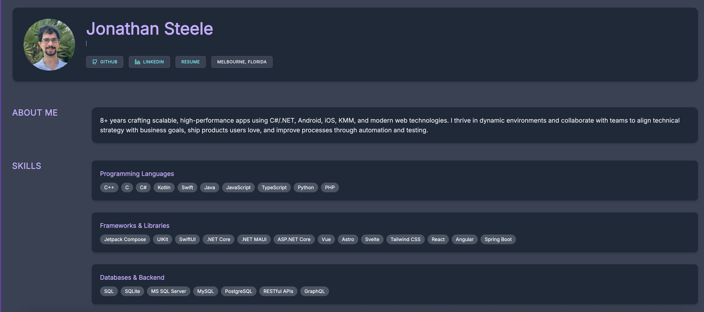

# 🌌 Developer Portfolio Site


A fast, modern developer portfolio built with Astro v6, styled using TailwindCSS, and powered by pnpm for efficient dependency management. Optimized for performance, accessibility, and clean modular structure.

## ✨ Features

- Astro v6 for ultra‑fast static site generation
- TailwindCSS for responsive, utility‑first styling
- pnpm for efficient, disk‑optimized package management
- SEO‑optimized pages and metadata
- Responsive design across all devices
- Modular components for easy maintenance and expansion

## 🚀 Getting Started

### Prerequisites

- pnpm installed
- Node.js 22+

### Installation

1. Clone the repository:

   ```bash
   git clone https://github.com/iNoles/inoles.github.io.git
   cd inoles.github.io
   ```

2. Install dependencies using pnpm:

   ```bash
   pnpm install
   ```

### Available Scripts

- `pnpm dev`: Start the development server.
- `pnpm build`: Create a production build.
- `pnpm preview`: Preview the production build.

## Screen Shot


## Contributing

Contributions are welcome! Here's how you can help:

1. Fork the repository.
2. Create your feature branch (`git checkout -b feature/YourFeature`).
3. Commit your changes (`git commit -m 'Add YourFeature'`).
4. Push to the branch (`git push origin feature/YourFeature`).
5. Open a pull request.
